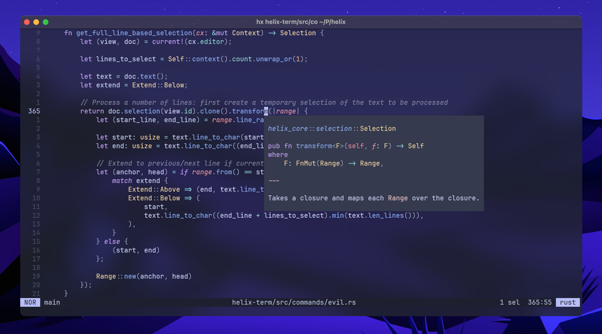

<div align="center">

<h1>evil-helix</h1>

A soft fork of [Helix](https://helix-editor.com) which introduces Vim keybindings and more.

[](https://github.com/usagi-flow/helix/actions/workflows/evil-build.yml)



<hr />

</div>

> [!IMPORTANT]
> This project is a work-in-progress, but should be stable enough for daily usage.

## Installation

[Download a package](https://github.com/usagi-flow/evil-helix/releases) and extract it in `/opt`. Additionally, it's recommended to symlink it in `/usr/local/bin`:

```sh
cd /opt
sudo curl -Lo helix.tar.gz https://github.com/usagi-flow/evil-helix/releases/download/release-<VERSION>/helix-<ARCH>-<OS>.tar.gz
sudo tar -xf helix.tar.gz
cd /usr/local/bin
sudo ln -sv /opt/helix/hx .
```

Builds are not in package repositories yet.

## Project philosophy

### Configurable features instead of plugins

This fork seeks to implement functionality as part of the editor, and make it configurable.
The added functionality includes a Vim look-and-feel, but also other features.

In contrast, the upstream project, Helix, mostly limits its scope to its current core functionality, and defers further functionality to the future Scheme-based plugin system.

Compared to plugins, implementing features as part of the editor greatly improves performance, and avoids the risk of plugin compatibility issues.

### Sensible defaults

In addition, sensible defaults are crucial:
The editor must offer a wide range of tools for your job, but it must do what you expect an editor to do.

### Avoid Scheme/Lisp

Scheme/Lisp should not be forced onto the user.
It's error-prone and harder to read by humans, compared to Rust/TOML/Lua/...

If upstream Helix moves to a [Scheme-based configuration](https://github.com/helix-editor/helix/issues/10389),
this project will seek to keep a user-friendly alternative.

## Project goals

-	Introduce more Vim keybindings
-	Implement common/crucial features as part of the editor:
	-	File tree (cf. [upstream PR](https://github.com/helix-editor/helix/pull/5768))
	-	Light/dark mode support
	-	Modeline support (cf. [upstream PR](https://github.com/helix-editor/helix/pull/7788))
-	Maintain compatibility with upstream
	-	Isolate features to minimize conflicts with upstream changes
	-	Contribute features to upstream where possible
	-	Ensure (through CI) that rebasing is always possible
	-	Find a name for this project